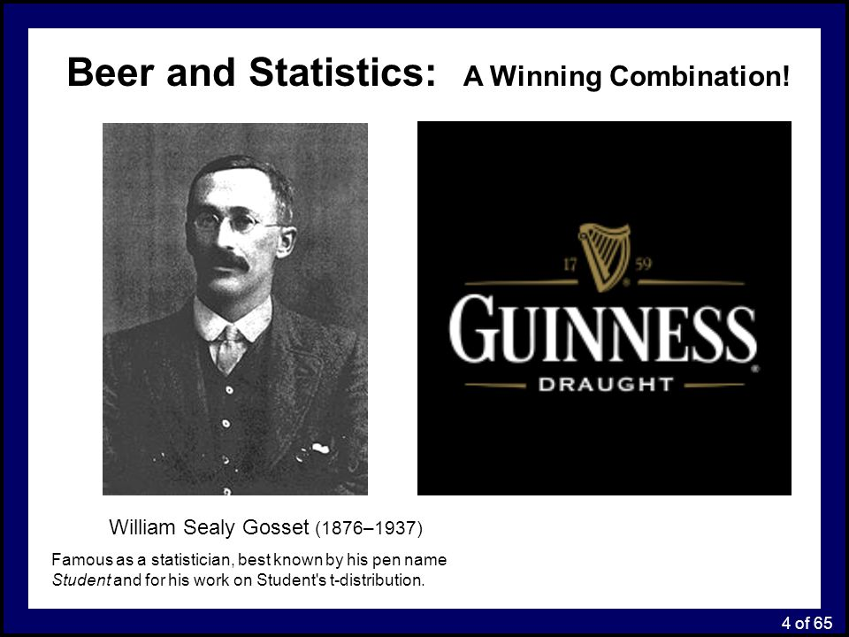

```{r setup, include=FALSE}
library(learnr)
library(mosaic)
library(ggformula)
library(patchwork)
library(sm)
knitr::opts_chunk$set(echo = FALSE)
```

```{r, echo=FALSE}
# Functions from example site
# Generate normal data with known parameters
rnorm_fixed = function(N, mu = 0, sd = 1)
  scale(rnorm(N)) * sd + mu
signed_rank = function(x) sign(x) * rank(abs(x))
# Plot style.
theme_axis = function(P,
                      jitter = FALSE,
                      xlim = c(-0.5, 2),
                      ylim = c(-0.5, 2),
                      legend.position = NULL) {
  P = P + theme_bw(15) +
    geom_segment(
      x = -1000, xend = 1000,
      y = 0, yend = 0,
      lty = 2, color = 'dark gray', lwd = 0.5
    ) +
    geom_segment(
      x = 0, xend = 0,
      y = -1000, yend = 1000,
      lty = 2, color = 'dark gray', lwd = 0.5
    ) +
    coord_cartesian(xlim = xlim, ylim = ylim) +
    theme(
      axis.title = element_blank(),
      axis.text = element_blank(),
      axis.ticks = element_blank(),
      panel.border = element_blank(),
      panel.grid = element_blank(),
      legend.position = legend.position
    )
  
  # Return jittered or non-jittered plot?
  if (jitter) {
    P + geom_jitter(width = 0.1, size = 2)
  }
  else {
    P + geom_point(size = 2)
  }
}

```


```{r, echo=FALSE}
set.seed(40)
# Data from example site
y = c(rnorm(15), exp(rnorm(15)), runif(20, min = -3, max = 0))  # Almost zero mean, not normal
x = rnorm_fixed(50, mu = 0, sd = 1)  # Used in correlation where this is on x-axis
y2 = rnorm_fixed(50, mu = 0.5, sd = 1.5)  # Used in two means

# Long format data with indicator
value = c(y, y2)
group = rep(c('y1', 'y2'), each = 50)
```


## "Please do stats test XYZ"

When you are collecting data for other modules, or in your Stage 3 projects, you
will often find that a member of staff is suggesting that you analyse your data
with a statistical test that you have not heard of. However, many of these 
'standard' statistical tests can be considered to be linear models. If you find
it less confusing to consider them as forms of linear models, then feel free to
stick to that. If you prefer to use the built-in R commands for each test, then
that is fine also. **What matters is the underlying hypothesis** that you are
trying to test. This will determine the exact structure of your `lm` or `glm`
function, or which built-in R command to use instead.

This website simply compares some of the commonly encounted statistical tests
in their __linear model__ format and their __built-in__ format. You can find
full details of this philosphy for teaching statistics at https://lindeloev.github.io/tests-as-linear/

### t-distribution
A lot of 'standard' statistical tests use the t-distribution, and you will often
here people refer to 't-tests', 'paired t-tests', 'one-sample t-tests'. These are
generally introduced early in statistics courses, as they are all relatively 
simple tests, although you have to know when to apply which one. A disadvantage is
that in Stage 3, when I ask students **"How are you planning to analyse your data?"**
the most common answer is **"Oh, perhaps a t-test"** because this is the first 
stats test they learnt and hence the easiest to remember. But first a quiz about
drinks (which yes, does link to t-tests)...

```{r quiz}
question("Which alcoholic beverage is related to the t-distribution?",
         answer("Smirnoff vodka"),
         answer("Rioja wine"),
         answer("Guiness stout", correct = TRUE),
         answer("Newcastle Brown Ale"),
         answer("Jameson's whiskey"),
         allow_retry = TRUE
)
```

Even if you managed to find the correct answer, you're probably puzzled (unless
you already know the strange story). Keep reading...

## The t-distribution
This distribution looks very similar to a normal distribution in that it forms a
bell-shaped curve. The differences are only obvious when one is laid on top of
the other, with the t-distribution in red:

```{r t_vs_normal}
xvs <- seq(-4, 4, 0.01)
plot(xvs, dnorm(xvs), type="l", lty=2, ylab="Probability density", xlab="Deviates")
lines(xvs, dt(xvs, df=5), col="red")
```

The two curves are very similar, with the t-distribution having "fatter" tails. It
is generall known as **Student's t-distribution**. It was developed by W.S.Gossett
in 1908 who worked for Guiness Breweries in Dublin



Gossett wanted to distinguish between the quality of Guiness stout based on the
different types of malt used in the brewing process, and developed the t-distribution
instead of the normal distribution as it was slightly more robust with small sample
sizes. However, Guiness Breweries wanted to keep the method secret, and would not
let him publish the technique. Gossett then published it under the pseudonym "Student"
and the name has stuck.

You will often encounter t-statistics, often to check whether an estimated parameter
from a model, such as an intercept or gradient, differs from zero. If the parameter
is big (large negative or positive value), then the t-statistic will statistically
significant (p<0.05), whereas if the parameter is roughly zero, the t-statistic will
be non-significant (p>0.05). You may encounter several different types of t-tests,
as well as their **non-parametric** equivalents.

### What is a non-parametric test?
Many statistical tests exist in non-parametric versions, including t-tests, and
you may be asked about them from project supervisor or encounter them in textbooks.
They work on **rankings** rather than the original raw data. So they would convert
the response variable numbers `5.2, 1.8, 8.9` into `2, 3, 1` to represent their
**order**. They can be useful when your data are very badly skewed, but they are
far less powerful in detecting patterns.

## One-sample t-test
This is the simplest form of t-test. You are basically trying to determine whether
your numbers differ from zero (either positively or negatively), or whether your
dataset is roughly the same as zero. The non-parametric equivalent is known as
the Wilcoxon signed-rank test. **Note** As all you are trying to do is determine
whether a set of numbers differs from zero, there is not an explanatory variable.

The following diagram summarises the idea for the one-sample t-test and Wilcoxon
test respectively. The question you are addressing is whether the blue horizontal
line significantly differs from zero.

```{r one_sample_t_test, warning=FALSE}


# T-test
D_t1 = data.frame(y = rnorm_fixed(20, 0.5, 0.6),
                  x = runif(20, 0.93, 1.07))  # Fix mean and SD

P_t1 = ggplot(D_t1, aes(y = y, x = 0)) + 
  stat_summary(fun.y=mean, geom = "errorbar", aes(ymax = ..y.., ymin = ..y.., color='beta_0'), lwd=2) +
  scale_color_manual(name = NULL, values = c("blue"), labels = c(bquote(beta[0] * " (intercept)"))) +
  
  geom_text(aes(label = round(y, 1)), nudge_x = 0.2, size = 3, color = 'dark gray') + 
  labs(title='         T-test')

# Wilcoxon
D_t1_rank = data.frame(y = signed_rank(D_t1$y))

P_t1_rank = ggplot(D_t1_rank, aes(y = y, x = 0)) + 
  stat_summary(fun.y = mean, geom = "errorbar", aes(ymax = ..y.., ymin = ..y..,  color = 'beta_0'), lwd = 2) +
  scale_color_manual(name = NULL, values = c("blue"), labels = c(bquote(beta[0] * " (intercept)"))) +

  geom_text(aes(label = y), nudge_x = 0.2, size = 3, color = 'dark gray') + 
  labs(title='         Wilcoxon')


# Stich together using patchwork
theme_axis(P_t1, ylim = c(-1, 2), legend.position = c(0.6, 0.1)) + 
  theme_axis(P_t1_rank, ylim = NULL,  legend.position = c(0.6, 0.1))
```

In the above plot, notice how the original values are showing for the t.test
plot, whereas the ranked (ordered) values are showing for the non-parametric
Wilcoson plot.

#### One-sample t-test
This is how you can check whether your mean value for your data is different from
zero, using the conventional built-in `t.test()` function, or when expressed
as a linear model with `lm()`. Notice for the linear model, we are setting the
explanatory variable to the number `1` as we simply want to check if we differ
from zero.

Let's try the two functions on a dataset `y` with 50 values (you will see 49
degrees of freedom as a result)

```{r, one_samp_t-setup}
set.seed(40)
# Data from example site
y = c(rnorm(15), exp(rnorm(15)), runif(20, min = -3, max = 0))  # Almost zero mean, not normal
x = rnorm_fixed(50, mu = 0, sd = 1)  # Used in correlation where this is on x-axis
y2 = rnorm_fixed(50, mu = 0.5, sd = 1.5)  # Used in two means

# Long format data with indicator
value = c(y, y2)
group = rep(c('y1', 'y2'), each = 50)

```

```{r one_samp_t, exercise=TRUE}
# Built-in t-test
a <- t.test(y)
a

# Equivalent linear model: intercept-only
b <- lm(y ~ 1)
summary(b)
```

Although the formatting of the output from the two tests is slightly different
note that the mean (shown as *Estimate* for `lm`) t-statistics, p-values etc.
are almost identical.